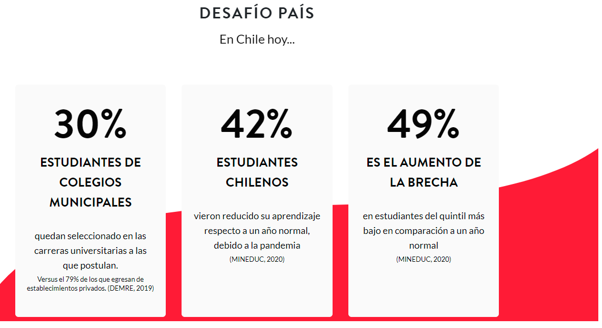
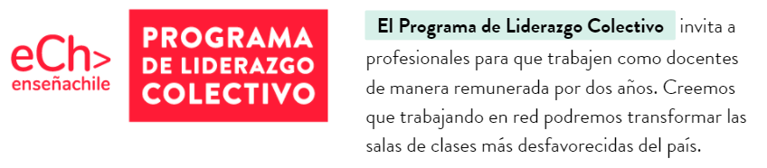
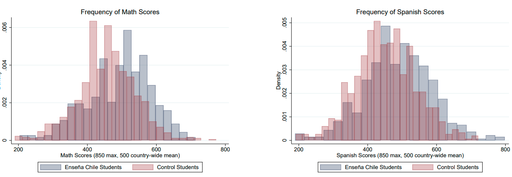
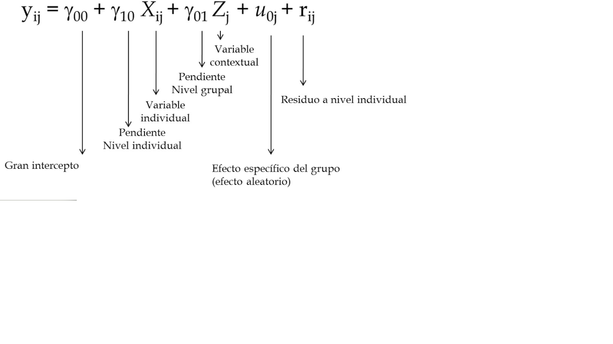
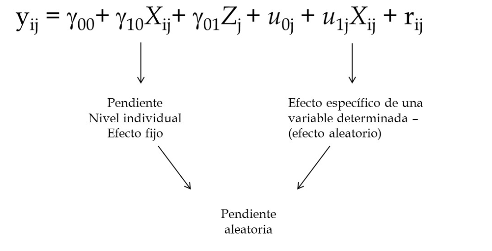

class: inverse, bottom, right

```{r, include=FALSE,echo=FALSE,results='hide'}
#install.packages("pagedown")
#pagedown::chrome_print("Presentacion.html",output="Presentacion.pdf")
```


```{r setup, include=FALSE, cache = FALSE}
require("knitr")
options(htmltools.dir.version = FALSE)
pacman::p_load(RefManageR)
```

```{r eval=FALSE, echo=FALSE}
# Correr esta linea para ejecutar
rmarkdown::render('xaringan::moon_reader')
```

<!---
About macros.js: permite escalar las imágenes como [:scale 50%](path to image), hay si que grabar ese archivo js en el directorio.
.pull-left[<images/Conocimiento cívico.png>] 
.pull-right[<images/Conocimiento cívico_graf.png>]

--->

# __¿Cómo afectan los docentes eCh sobre los puntajes de los estudiantes de escuelas de bajo rendimiento?__
## * Síntesis, evaluación metodológica y proyecciones teóricas*
<br>
<hr>
# Revisión de artículo para proceso de postulación

### Francisco Javier Meneses Rivas, Postulación al cargo de 
### *Coordinador de Gestión e Investigación en Enseña Chile*

<br>


---

layout: true
class: animated, fadeIn

---
class: inverse, middle, center, slideInRight

#  Problema social, programa social, y la evaluación del programa
---
## La desigualdad educativa como problema

.center[]

## La colaboración como solución

.center[]
???

## Contexto

* Según Cristian Cox [(2012)](https://www.redalyc.org/articulo.oa?id=297325499002), las políticas públicas de la concertación han logrado aumentar la cobertura y la calidad, pero se ha mantenido y reforzado la inequidad en educación. Existe contundente evidencia sobre la desigualdad del sistema educativo, así como de las consecuencias de esta desigualdad. 

* Frente a esta situación Enseña Chile tiene como objetivo "QUE UN DÍA TODOS LOS NIÑOS EN CHILE RECIBAN EDUCACIÓN DE CALIDAD."


---

### ¿Cuál es el efecto del programa de liderazgo educativo? (Muñoz, 2021)

> __Objetivo:__ Comprender la mejora en el rendimiento de estudiantes de colegios con bajos resultados producida por la presencia de profesores de EnseñaChile

> __Metodología:__ Se realizan dos regresiones a distintos niveles para comprender el efecto de la presencia de pEChs en los requisitos para la selección universitaria. 
--

### Resultados

.center[]


???


## resumen

* El objetivo del texto es comprobar empíricamente el efecto positivo de los profesores eCh en los estudiantes de establecimientos de bajo rendimiento.  

* Para ello se trabajó con datos del DEMRE y de eCh, con el objetivo de generar información sobre la mejora de los estudiantes 

para evaluar diferencias sobre diferencias, en un estudio cuasiexperimental de experimento natural, tanto a nivel de los estudiantes dentro de una escuela, como a nivel de las escuelas. 

* Los resultados indican que la participación de los pEChs genera un efecto positivo, significativo y de moderada intensidad sobre indicadores de selección universitaria como las pruebas PSU, el ranking, el NEM y la selección de BEA. 

---
class: inverse, middle, center, slideInRight

#  Consideraciones metodológicas

---

# Sofisticación metodológica, métodos multinivel y efectos aleatorios
  
#### Regresiones del artículo (efecto fijo)

\begin{equation}
Y_{i,s,t}= \beta_0 + \beta_{1}ECh_{i} + {BX}_{i}  +\epsilon_{s,t}
\end{equation}

\begin{equation}
Y_{i,s,t}= \beta_0 + \delta_{s} + \gamma_{t} + \sum_{r}\alpha_{r}{1}_{tst=r}+ {Bx}_{i} +\epsilon_{s,t}
\end{equation}

--

#### Nueva propuesta (efectos aleatorios)

\begin{equation}
{Y_{ist}}= \gamma_{000} +\gamma_{100}\text{X}_{ist} + \gamma_{010}\text{Z}_{s} + \gamma_{001}\text{T}_{t} + u_{0j } + u_{1j}*X_{IJ} +r_{ij}
\end{equation}
  
???

El trabajo metodológicamente tiene dos propuestas. 

  1.  Evaluar la diferencia entre estudiantes con y sin pEChs de un mismo establecimiento
  2.  Evaluar las diferencias entre escuelas con y sin participación de pEChs
  
__Mi propuesta__: Creo que es necesario hacer una evaluación de ambas cosas al mismo tiempo recurriendo a técnicas multinivel y efectos aleatorios. 

* Comprender cuanto varía el efecto de los profesores eCh entre escuelas.

* Comprender cómo las características del contexto dificultan o fomentan el trabajo de los profesores eCh.

* Comprender cómo los profesores Ech influyen en el contexto, incluso en estudiantes a los que no le hacen clases. Esto debería suceder si los profesores tienen una lógica colaborativa y dan consejos a otros profesores, o por lo menos los motivan. 

.center[]

.center[]
---

# Otras consideraciones metodológicas

* Evaluar la necesidad de incluir colegios que no son de bajo rendimiento.


* Evaluar la necesidad de incluir los años de estallido (2019) y de pandemia.


* Evaluar la posibilidad de incluir notas anteriores de los estudiantes.

???

1. Tener colegios con otros resultados: 
  
    * Comparar resultados, viendo capacidad de alcanzar a sus pares de mejores establecimientos. 

    * Generar brecha de resultados. 
    
2. Tener datos pandemia 
    * Permite evaluar si los pEChs amortiguaron las consecuencias negativas de la pandemia. 

3. Notas anteriores

    * Uno de los problemas que señala Muñoz es que quizás los jóvenes más interesados y capaces eligen profesores pEChs, lo cual sesga el efecto. Para evaluar esta posibilidad se puede incluir como control las notas anteriores del estudiante. Revisé y esta información está disponible.
    
  
---
class: inverse, middle, center, slideInRight

#  Propuestas y proyecciones

---

# Nuevas preguntas de investigación:

* Contexto de pandemia

> ¿Fueron capaces los pEChs de amortiguar el aumento de la brecha educativa? 

--
 
* Evaluando las características de los pEChs

> ¿Qué cualidades de los pEChs están asociadas a mejores resultados de los estudiantes? 

--

* Evaluando el contexto escolar 

> ¿Existe alguna cualidad de las escuelas que dificulte el desarrollo de la política? 
  
    
      
      

???

* Contexto de pandemia

 - ¿Fueron capaces los pEChs de amortiguar el aumento de la brecha educativa? 
 
--
 
* Evaluando las características pEChs

  - ¿Qué cualidades de los pEChs están asociadas a mejores resultados de los estudiantes? 

      + Años de educación
      + Puntaje postulación ECh
      + Tiempo de especialización en ECh
      + Profesión
      
--

* Evaluando el contexto escolar 

  - ¿Existe alguna cualidad de las escuelas que dificulte el desarrollo de la política? 
  
      + Bajo nivel de liderazgo en red en la escuela
      + Relación del profesor pEChs con los estudiante


